# Message Module Dependency Analysis

## 1. Files with No Internal Dependencies (External crates only)

### Completely Independent Files:
- **message.rs** - Only uses `nexus_actor_utils_rs` and std
- **not_influence_receive_timeout.rs** - Only uses std
- **readonly_message_headers.rs** - Only uses std
- **receive_timeout.rs** - Only uses std (imports `crate::actor::message::message::Message` but that's within the same module)
- **terminate_reason.rs** - No dependencies at all

### Files with only generated imports:
- **touched.rs** - Only imports `crate::generated::actor::Pid` and the Message trait
- **dead_letter_response.rs** - Only imports `crate::generated::actor::DeadLetterResponse`

## 2. Files with Internal Dependencies (use crate::)

### Core Dependencies:
- **auto_receive_message.rs**
  - `crate::actor::core::ExtendedPid`
  - `crate::generated::actor::Terminated`

- **auto_respond.rs**
  - `crate::actor::context::ContextHandle`

- **continuation.rs**
  - No internal dependencies outside message module

- **failure.rs**
  - `crate::actor::core::ErrorReason`
  - `crate::actor::core::ExtendedPid`
  - `crate::actor::core::RestartStatistics`

- **ignore_dead_letter_logging.rs**
  - No internal dependencies outside message module

- **message_batch.rs**
  - No internal dependencies outside message module

- **message_batch_test.rs**
  - `crate::actor::actor_system::ActorSystem`
  - `crate::actor::context::{MessagePart, SenderPart, SpawnerPart}`
  - `crate::actor::core::Props`

- **message_handle.rs**
  - `nexus_actor_utils_rs::collections::{Element, PriorityMessage}`

- **message_handles.rs**
  - No internal dependencies outside message module

- **message_headers.rs**
  - No internal dependencies outside message module

- **message_or_envelope.rs**
  - `crate::actor::core::ExtendedPid`

- **message_or_envelope_test.rs**
  - `crate::actor::actor_system::ActorSystem`
  - `crate::actor::context::{BasePart, MessagePart, SenderPart, SpawnerPart}`
  - `crate::actor::core::Props`

- **response.rs**
  - No internal dependencies outside message module

- **system_message.rs**
  - `crate::generated::actor::{Terminated, Unwatch, Watch}`

- **typed_message_or_envelope.rs**
  - `crate::actor::core::ExtendedPid`

## 3. Dependency Graph

```mermaid
graph TD
    %% External dependencies
    ext_std[std library]
    ext_nexus_utils[nexus_actor_utils_rs]
    ext_nexus_derive[nexus_actor_message_derive_rs]
    ext_async_trait[async_trait]
    ext_futures[futures]
    ext_dashmap[dashmap]
    ext_once_cell[once_cell]
    ext_tokio[tokio]
    ext_tracing[tracing]
    ext_static_assertions[static_assertions]
    ext_tracing_subscriber[tracing_subscriber]

    %% Internal modules
    actor_system[actor::actor_system]
    context[actor::context]
    core[actor::core]
    generated[generated::actor]

    %% Message module files
    message[message.rs]
    auto_receive_message[auto_receive_message.rs]
    auto_respond[auto_respond.rs]
    continuation[continuation.rs]
    dead_letter_response[dead_letter_response.rs]
    failure[failure.rs]
    ignore_dead_letter_logging[ignore_dead_letter_logging.rs]
    message_batch[message_batch.rs]
    message_batch_test[message_batch_test.rs]
    message_handle[message_handle.rs]
    message_handles[message_handles.rs]
    message_headers[message_headers.rs]
    message_or_envelope[message_or_envelope.rs]
    message_or_envelope_test[message_or_envelope_test.rs]
    not_influence_receive_timeout[not_influence_receive_timeout.rs]
    readonly_message_headers[readonly_message_headers.rs]
    receive_timeout[receive_timeout.rs]
    response[response.rs]
    system_message[system_message.rs]
    terminate_reason[terminate_reason.rs]
    touched[touched.rs]
    typed_message_or_envelope[typed_message_or_envelope.rs]

    %% External dependencies
    message --> ext_nexus_utils
    message --> ext_std
    auto_receive_message --> ext_nexus_derive
    auto_receive_message --> ext_static_assertions
    auto_respond --> ext_async_trait
    auto_respond --> ext_futures
    continuation --> ext_futures
    continuation --> ext_static_assertions
    continuation --> ext_tracing
    failure --> ext_nexus_derive
    ignore_dead_letter_logging --> ext_nexus_derive
    ignore_dead_letter_logging --> ext_static_assertions
    message_batch --> ext_nexus_derive
    message_batch_test --> ext_tokio
    message_batch_test --> ext_tracing_subscriber
    message_handles --> ext_tokio
    message_headers --> ext_dashmap
    message_headers --> ext_once_cell
    message_or_envelope --> ext_nexus_derive
    message_or_envelope_test --> ext_tokio
    message_or_envelope_test --> ext_tracing_subscriber
    message_or_envelope_test --> ext_nexus_derive

    %% Internal message module dependencies
    auto_receive_message --> message
    auto_receive_message --> message_handle
    auto_respond --> message
    auto_respond --> response
    continuation --> message
    continuation --> message_handle
    dead_letter_response --> message
    failure --> message
    failure --> message_handle
    ignore_dead_letter_logging --> message
    message_batch --> message
    message_batch --> message_handle
    message_batch_test --> message_batch
    message_batch_test --> message_handle
    message_handle --> message
    message_handles --> message_handle
    message_headers --> readonly_message_headers
    message_or_envelope --> message_handle
    message_or_envelope --> message_headers
    message_or_envelope --> readonly_message_headers
    message_or_envelope --> system_message
    message_or_envelope --> message
    message_or_envelope_test --> message
    message_or_envelope_test --> message_handle
    message_or_envelope_test --> readonly_message_headers
    message_or_envelope_test --> response
    receive_timeout --> message
    response --> message
    system_message --> message
    touched --> message
    typed_message_or_envelope --> message
    typed_message_or_envelope --> message_or_envelope
    typed_message_or_envelope --> message_headers

    %% Internal crate dependencies
    auto_receive_message --> core
    auto_receive_message --> generated
    auto_respond --> context
    failure --> core
    message_batch_test --> actor_system
    message_batch_test --> context
    message_batch_test --> core
    message_or_envelope --> core
    message_or_envelope_test --> actor_system
    message_or_envelope_test --> context
    message_or_envelope_test --> core
    system_message --> generated
    touched --> generated
    typed_message_or_envelope --> core
    dead_letter_response --> generated

    %% Highlight independent files
    style terminate_reason fill:#90EE90
    style not_influence_receive_timeout fill:#90EE90
    style readonly_message_headers fill:#90EE90
    style message fill:#90EE90
    style receive_timeout fill:#90EE90
```

## Summary

### Least Dependent Files (Good candidates for testing in isolation):
1. **terminate_reason.rs** - No dependencies
2. **not_influence_receive_timeout.rs** - Only std
3. **readonly_message_headers.rs** - Only std
4. **message.rs** - Only external crate dependency
5. **receive_timeout.rs** - Only depends on message trait

### Most Central Files (Core of the module):
1. **message.rs** - Defines the core Message trait
2. **message_handle.rs** - Wrapper for messages, used by many other files
3. **message_headers.rs** & **readonly_message_headers.rs** - Header management
4. **message_or_envelope.rs** - Message envelope functionality

### Files with Heavy External Dependencies:
1. **message_batch_test.rs** - Depends on actor_system, context, and core
2. **message_or_envelope_test.rs** - Similar heavy dependencies
3. **auto_receive_message.rs** - Depends on core and generated
4. **failure.rs** - Depends on multiple core types