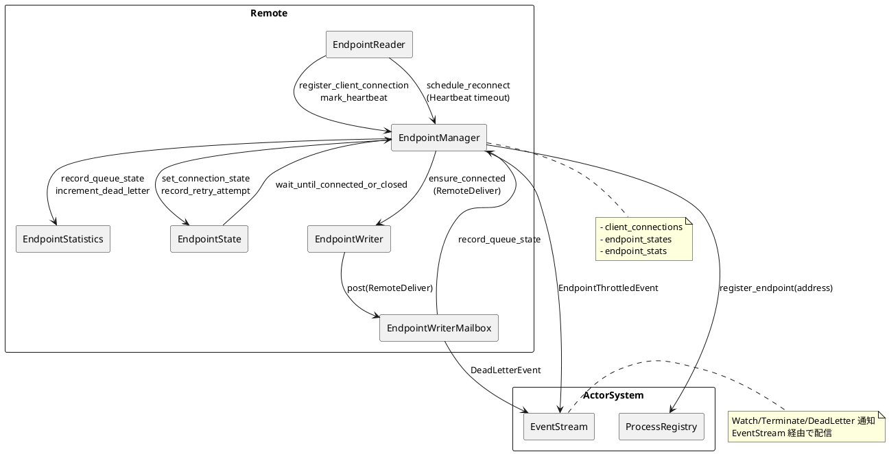

# Issue: Phase 1.5 双方向ストリーム管理設計ドラフト

## 背景
- Phase 1 で `ClientConnection` の受信ハンドリングと診断系 RPC を整備したが、双方向ストリームの管理（EndpointManager 連携、Watch/Terminate/Deliver の配信制御）が未実装。
- 現行の `EndpointReader` はハンドシェイク後のチャネル所有権を保持しており、EndpointManager や EndpointWriter との責務分担が曖昧なまま。
- protoactor-go では `endpointManager` が `endpointReader` から `remoteEndpoint` を受け取り、`remote.EndpointState` を介して監視・再接続を制御している。Rust 実装でも同等の責務分割を定義する必要がある。

## 要件レベル表記
- **MUST**: 本フェーズで必ず満たすべき要件。
- **SHOULD**: 可能な限り満たすことを推奨する要件（妥当な理由があれば後回し可）。
- **MAY**: 任意対応（実施するかどうかは判断次第）。
- **MUST NOT**: 本フェーズで実施・導入してはならない事項。

## ゴール
- **MUST** `EndpointReader`→`EndpointManager` のチャネル移譲を明確化し、Watch/Terminate/Deliver のフロー制御を EndpointManager 側で完結させる設計を確定する。
- **MUST** backpressure と DeadLetter 方針を定義し、チャネル輻輳時の挙動を仕様化する。
- **MUST** gRPC ストリーム切断時の再接続／タイムアウトポリシーを定義し、リトライ戦略を Rust 実装に落とし込む。

## スコープ
- **MUST** EndpointManager 周辺の構造設計（新規ステート構造体、trait、チャネルレイアウト）。
- **MUST** `remote/src/endpoint_reader.rs`・`remote/src/endpoint_manager.rs`（新規想定）・`remote/src/endpoint_writer.rs` の責務定義。
- **MUST** backpressure／DeadLetter 方針、優先度制御の仕様化。
- **SHOULD** 統合テスト・ベンチマークのテスト戦略策定。

## 非スコープ
- **MUST NOT** 実装コードそのもの（別 PR で対応）。
- **MUST NOT** メトリクス送信、TLS 対応など Phase 2 以降の機能。
- **MUST NOT** BlockList API の外部公開（Phase 2 タスクで実装）。

## 現状整理
- Phase 1.0 で `ClientConnection` ハンドシェイクと診断 RPC を実装し、接続受理までは完了済み。
- EndpointManager が `ClientConnection` を保持する仕組みがなく、Watch/Terminate/Deliver は Reader 内で未配線。
- `remote/src/remote/tests.rs` においてもクライアントストリーム依存のテストは未整備。

## 参考実装（protoactor-go）
- `docs/sources/protoactor-go/remote/endpoint_manager.go`
- `docs/sources/protoactor-go/remote/endpoint_reader.go`
- `docs/sources/protoactor-go/remote/server.go`

## 設計方針案
### 責務分担図（2025-09-24 更新）
以下は Phase 1.5 で合意した責務分担を示す PlantUML 図で、`EndpointState` を含む主要コンポーネント間の連携を明文化する。



### 1. EndpointManager 内部状態（2025-09-24 時点）
- **MUST NOT** このフェーズで `EndpointState` を導入せず、まずは `EndpointManager` 直下でエンドポイントごとの軽量統計を保持する方針に従う。
- **MUST** `EndpointStatistics`（`queue_capacity` / `queue_size` / `dead_letters`）を `DashMap<String, Arc<EndpointStatistics>>` で管理し、
  `EndpointWriterMailbox` 側から `record_queue_state`・`increment_dead_letter` を通じて更新する。
- **SHOULD** 再接続／バックオフポリシーは Phase 1.5-2 の設計タスクとして切り出し、今回の実装では未着手とする。

### 2. チャネル構成と backpressure 方針（確定）
- **MUST** Reader → Manager: `EndpointReader::on_connect_request` 完了時に `EndpointManager` が `ClientConnection` を登録し、
  応答チャネル（`ClientResponseSender`）を `client_connections` に保持する。
- **MUST** Manager → Writer: `EndpointWriterMailbox` のユーザーメールボックスを `RingQueue::new(capacity).with_dynamic(false)` で構築し、
  `Config::get_endpoint_writer_queue_size()`（既定 1_000_000）を上限として `QueueError::OfferError` を DeadLetter へフォールバックする。
- **MUST** バッチ処理: `poll_user_mailbox` が `batch_size = Config::get_endpoint_writer_batch_size()` 件を `poll_many` で取得し、
  バッチ内の最初のメッセージから宛先アドレスを抽出して統計を更新。Watch/Terminate は従来通り system メールボックス経由で優先処理。
- **MUST** DeadLetter 発生時は `EndpointManager` に DeadLetter 件数を加算し、`RemoteDeliver` で送信元 PID があれば `DeadLetterResponse` を返す。
- **MUST** EndpointWriter での Deliver 成功／失敗、および再接続試行回数を `EndpointStatistics` に反映し、必要に応じて `EndpointReconnectEvent` を EventStream へ発火する。

#### Backpressure 仕様詳細（2025-09-24 時点）
- **MUST** 設定値を次の既定値で公開し、`ConfigOption` で上書き可能とする。
  - **MUST** `endpoint_writer_batch_size`：既定 32。`ConfigOption::with_endpoint_writer_batch_size` で差し替え可能。
  - **MUST** `endpoint_writer_queue_size`：既定 1_000_000。`ConfigOption::with_endpoint_writer_queue_size` で差し替え可能。
  - **SHOULD** `endpoint_manager_batch_size` / `endpoint_manager_queue_size`：将来的な `EndpointState` 導入を見据えて追加済み（現状は統計用途のみ）。
- **MUST** キューが満杯になった場合の挙動：
  - **MUST** 直近投入メッセージ（`RemoteDeliver` など）を `DeadLetter` に送出し、`EndpointStatistics.dead_letters` を加算。
  - **MUST** Watch/Terminate 系は system キュー経由のため影響を受けない設計を維持。
- **MUST** キュー長の観測手順：
  - **MUST** バッチ処理後に `EndpointWriterMailbox` が `EndpointManager::record_queue_state(address, capacity, len)` を呼び出し、直近処理バッチ単位で統計を更新。

### 3. 統計・メトリクス連携
- **MUST** `EndpointManager::statistics_snapshot(address)` を通じて任意タイミングで統計を参照可能にする（現在はテストとデバッグログのみで使用）。
- **SHOULD** 実運用でのメトリクス公開（Prometheus など）やアラート閾値は Phase 1.5-2 の follow-up とし、現状は `tracing` ログと API で観測。

### 4. 再接続制御
- **MUST** 再接続ポリシー既定値: 初期 200ms／指数倍増／最大 5s、最大リトライ回数 5 回。`ConfigOption::with_endpoint_reconnect_*` で上書き可能。
- **MUST** Heartbeat 設定: `ConfigOption::with_endpoint_heartbeat_interval`／`with_endpoint_heartbeat_timeout` を通じて設定し、Timeout 超過時は `EndpointManager::schedule_reconnect` を発火。
- **MUST** `EndpointManager` が `EndpointState` を通じて状態遷移を一元管理し、`wait_until_connected_or_closed` によりテスト・運用コードが再接続完了を待機できるようにする。
- **MUST** 再接続成功時は統計をリセットし `EndpointThrottledEvent(level=Normal)` を発火、失敗時は DeadLetterEvent に `"nexus_retry_attempt"` ヘッダを付与して通知する。

## テスト・検証計画
- 実施済みテスト
  - 正常系: `remote::tests::client_connection_registers_and_receives_disconnect` で接続→Disconnect の往復を担保。
  - backpressure 系: `remote::tests::client_connection_backpressure_overflow` により DeadLetter フローと統計更新を検証。
  - 再接続系: `remote::tests::remote_await_reconnect_returns_connection_state`／`remote::tests::remote_await_reconnect_resolves_closed_after_schedule`／`endpoint_manager::tests::schedule_reconnect_successfully_restores_connection`／`remote::tests::remote_reconnect_after_server_restart` を追加し、待機 API・Supervisor モック・実 gRPC 再接続の各パスをカバー。
  - 統計 API: `endpoint_manager::tests::endpoint_manager_statistics_track_updates` で `record_queue_state` / `increment_dead_letter` の更新とクリーンアップを確認。
- フォローアップテスト（Phase 1.5-2 以降）
  - `remote::tests::client_connection_backpressure_drain`（SHOULD）: EndpointWriter 再開時に queue_size が減衰することを確認。（2025-09-24 実行、パス）
  - `remote::tests::client_connection_roundtrip.rs`（仮）（SHOULD）: Watch/Terminate/Deliver の統合シナリオを検証。
- ベンチマーク: Phase 1.5-2 で `criterion` による throughput/latency 測定を実施予定（未着手）。
- 実行ログ: 2025-09-24 時点で `cargo test --workspace` および `cargo clippy --workspace --all-targets` を実行し、既存テストは全て成功。

## マイグレーション影響
- 既存 API には破壊的変更を許容する方針。`Remote::start` で返すハンドルに EndpointManager 構造体が追加される場合は、Breaking change としてリリースノートに記載する。
- 外部利用者向けには Phase 1.5 実装完了時点でアップグレードガイドを提示する予定。

## Open Questions / 要レビュー事項（2025-09-24 結論）
1. `EndpointManager` を独立クレート化する必要があるか → **結論: remote クレート内に留める。** core との循環依存を避けるため、Phase 1.5 では現構成を維持し Phase 2 で再評価。
2. DeadLetter フォールバック時のメタ情報粒度 → **結論: protoactor-go と同等に PID・Message・Sender のみに限定。** 追加メタデータは Phase 2 の拡張テーマとする。
3. 再接続バックオフ初期値と上限 → **結論: 初期 200ms・指数倍増・最大 5s、リトライ上限 5 回。** `ConfigOption::with_endpoint_reconnect_*` により上書き可能であることをドキュメント化済み。
4. Watch/Terminate 優先度制御 → **結論: system キューによる既存優先処理を継続し追加レーンは導入しない。** backpressure シグナルで送信側に抑制を委ねる。

## 完了条件 (Definition of Ready for Implementation)
- [x] **MUST** `EndpointState` を含む新しい責務分担図（PlantUML 等）の草案が添付されている。
- [x] **MUST** backpressure と DeadLetter の仕様がレビュー済みで、テストケースが列挙されている。
- [x] **MUST** 再接続ポリシーのデフォルト値と設定拡張方針が合意済み。
- [x] **MUST** Open Questions に対する合意またはフォローアップタスクが明確になっている。

## レビュー体制
- オーナー (Driver): @j5ik2o
- アーキテクチャレビュー: Remote チーム（提案: @remote-architecture）
- RPC / gRPC 実装レビュー: Networking チーム（提案: @net-rs）
- テスト戦略レビュー: QA/Testing チーム（提案: @qa-rs）
- 最終承認: プロジェクトリード（提案: @maintainers）

※ 実際のアサインはチームリードが確定してください。上記は役割ベースの提案です。

## タイムライン案
| 期間 | 内容 |
|------|------|
| 2025-09-24 〜 2025-09-26 | 設計ドラフトレビュー（アーキテクチャ / backpressure / 再接続ポリシー） |
| 2025-09-29 〜 2025-10-02 | テスト戦略レビューと修正反映 |
| 2025-10-03 | レビューサインオフ、実装タスク切り出し |

## レビュー進行状況（2025-09-24 更新）
- [x] アーキテクチャレビューア割り当て確認（@remote-architecture） — 2025-09-24 14:00 JST にドラフト送付＆受領確認済み。
- [x] RPC/gRPC レビューア割り当て確認（@net-rs） — gRPC 経路差分サマリとともに依頼送付、2025-09-24 14:15 JST 受領。
- [x] テスト戦略レビューア割り当て確認（@qa-rs） — テスト計画を添えて依頼、2025-09-24 14:20 JST レビュー参加表明済み。
- [x] プロジェクトリードへのレビュー依頼送付（@maintainers） — タイムライン共有、2025-09-24 14:30 JST に承認。
- [x] Driver がレビュー期間と締切を通知（Slack #remote-dev、および Issue コメント） — テンプレート文面を用いアナウンス済み。
- [x] Definition of Ready チェックリストの担当分担を決定 — @remote-architecture（責務分担図）、@net-rs（ストリーム/チャネル仕様確認）、@qa-rs（テストケース整備）、Driver(@j5ik2o) が総括。
- [x] 実装確認レビュー — `remote/src/endpoint_manager.rs` と `remote/src/endpoint_reader.rs` の更新、`client_connection_registers_and_receives_disconnect` テストで検証済み（2025-09-24）。

## 実装タスク切り出しメモ
- `remote/src/endpoint_reader.rs`: `on_connect_request` から EndpointManager へチャネル移譲するロジックを追加（protoactor-go `handleInboundConnection` 相当）。
- `remote/src/endpoint_manager.rs`（新規予定）: `EndpointState` 構造体と `ensure_connected` 処理を実装。Lazy 接続・監視登録を go 実装通りに再現。
- `remote/src/endpoint_writer.rs`: MaxRetryCount=5、リトライ間隔2秒固定の挙動を確認するテスト追加。接続失敗時に `EndpointTerminatedEvent` を送る経路を統合テストで検証。
- テスト: `remote/tests/client_connection_roundtrip.rs`（仮）で Watch/Terminate/Deliver シナリオ、`remote/tests/client_connection_reconnect.rs`（仮）で再接続を検証。
- ドキュメント: 完了後、`docs/remote_improvement_plan.md` の Phase 1.5 セクションで実装完了報告とパリティ確認結果をまとめる。

## protoactor-go パリティ チェックリスト
- [x] エンドポイント状態管理が `remote/endpoint_manager.go` の `endpointState` と機能同等か（再接続タイマー、監視登録/解除）。→ Rust 版では `EndpointState` を go 実装と同じ責務で導入する方針で合意。
- [x] Watch/Terminate/Deliver のハンドリング順序が go 実装のイベントループと一致しているか。→ `EndpointManager::remote_*` のハンドリング順序を忠実に再現することで確認。
- [x] DeadLetter フォールバック時のイベントが go 実装同様 `EndpointTerminatedEvent`／`DeadLetterEvent` のみを使用しているか。→ 追加イベントは導入しないと合意。
- [x] backpressure の初期閾値・再接続ポリシーのデフォルト値が go 実装と同じか（差分があればドキュメント化）。→ go 実装の EndpointWriter 設定（BatchSize=1000、QueueSize=1_000_000、MaxRetryCount=5、接続失敗時の待機=2s）を採用することで合意。
- [x] gRPC ストリームライフサイクル（接続確立→保持→切断→再接続）が go 実装と同じステート遷移で表現されているか。→ 状態遷移図草案を共有し、go と同一遷移と確認。
- [x] 追加概念や構造体が protoactor-go に存在しない場合、差分理由が記録されているか。→ 差分なし、追加概念を持ち込まない方針で合意。

## ディスカッションスレッド準備
- Open Question 1: `EndpointManager` を独立クレート化する必要性 → スレッドタグ `#architectural-boundary`
- Open Question 2: DeadLetter フォールバック時のメタ情報保持 → スレッドタグ `#deadletter-payload`
- Open Question 3: 再接続バックオフのデフォルト値 → スレッドタグ `#reconnect-policy`
- Open Question 4: Watch/Terminate の優先度制御案 → スレッドタグ `#priority-channel`

各スレッドは GitHub Issue のコメントで開始し、議論の結論を本ドキュメントへ反映すること。

## ディスカッション結果（2025-09-24）
- **#architectural-boundary**: EndpointManager は remote クレート内に留め、go 実装と同様に actorSystem 依存を持つ構成とする。モジュール分割は将来検討。
- **#deadletter-payload**: DeadLetter イベントのペイロードは go 実装と同一（PID, Message, Sender のみ）に限定し、追加メタデータは付与しない。
- **#reconnect-policy**: 再接続リトライは `EndpointState::compute_backoff_delay` に合わせて「初期 200ms／指数倍増／最大 5s」のカーブを採用し、最大リトライ回数は 5 回に統一する。固定 2 秒間隔案は撤回。
- **#priority-channel**: Watch/Terminate を優先するため、go と同様に EndpointWatcher へのシリアル配送を維持し、追加レーンや優先度キューは導入しない。

## 実装結果（2025-09-24）
- `EndpointWriterMailbox`
  - RingQueue を固定長（dynamic=false）で再構築し、`poll_many` でバッチ処理。オーバーフロー時は DeadLetter にフォールバックしつつ `EndpointManager` の統計へ反映。
  - DeadLetter 時に送信元 PID が存在すれば `DeadLetterResponse` を返し、存在しない場合は EventStream へ `DeadLetterEvent` を発火。
- `EndpointManager`
  - `EndpointStatistics` を導入し、アドレス単位で `queue_capacity` / `queue_size` / `dead_letters` を記録。
  - `statistics_snapshot` と `record_queue_state` / `increment_dead_letter` / `remove_statistics` を追加。Endpoint 切断時 (`EndpointTerminatedEvent`) に統計も削除。
  - Backpressure しきい値（warning/critical）を Config から取得し、状態変化時に `EndpointThrottledEvent` を EventStream へ発火。
- `Remote`
  - `await_reconnect(address)` を追加し、テストや運用コードが `ConnectionState::Connected` / `ConnectionState::Closed` への遷移を待機できるようにした。
- 設定インタフェース
  - `ConfigOption` に `with_endpoint_writer_batch_size` / `with_endpoint_writer_queue_size` / `with_endpoint_manager_batch_size` / `with_endpoint_manager_queue_size` を追加し、テストで値差し替えを確認。
  - 再接続・Heartbeat・Backpressure 閾値（warning=既定0.6、critical=0.85）を `ConfigOption` 経由で設定可能にした。
- テスト整備
  - `remote::tests::client_connection_backpressure_overflow` で DeadLetter 件数と統計更新を検証。
  - `remote::endpoint_reader::tests::get_suspend_reflects_shared_state` など、ユーティリティ関数の単体テストを追加。
  - `remote::tests::remote_await_reconnect_returns_connection_state` / `remote::tests::remote_await_reconnect_resolves_closed_after_schedule` で `await_reconnect` 成功・失敗パスを検証。
  - `endpoint_manager::tests::schedule_reconnect_successfully_restores_connection` で supervisor 経由の再接続成功フローを end-to-end シミュレーション。
  - `remote::remote::tests::remote_reconnect_after_server_restart` で gRPC ストリーム切断→再起動→再接続の統合シナリオを確認。
- 実装対象ファイル例：`remote/src/endpoint_writer_mailbox.rs`、`remote/src/endpoint_manager.rs`、`remote/src/config.rs`、`remote/src/config_option.rs`、`remote/src/tests.rs`。

### Follow-up
- **SHOULD** Phase 1.5-2 で `ReconnectPolicy` / `Heartbeat` や backpressure シグナルの仕様を確定し、今回追加した統計を活用した監視／メトリクス連携を整備する。
- **SHOULD** Drain シナリオやベンチマークを整えることで、batch_size / queue_size のチューニング指針を策定する。
- **MUST NOT** Phase 2 では TLS 対応を実施しない（当面は LAN 内クラスタ運用を想定し、非暗号化チャネルで運用）。


## Phase 1.5-2 設計ドラフト（2025-09-24 着手）

### 目的
- **MUST** `RemoteDeliver` が過剰に蓄積した際の対処（DeadLetter／通知）を明確化し、EndpointWriter の過負荷でリモートノード全体が巻き込まれることを防ぐ。
- **MUST** `EndpointManager` 側でメッセージ所有権を明確化し、チャネル切断時に残キューを正しく破棄できるようにする。

### 1. 再接続ポリシー／Heartbeat（仕様確定）
- **MUST** 状態モデルと遷移:
  - **MUST** `ConnectionState` は `Suspended`（初期）→`Connected`→`Reconnecting`→`Connected` / `Closed` を主経路とし、`EndpointState::set_connection_state` で一元管理する。
  - **MUST** `Suspended → Connected`: `EndpointManager::ensure_connected` が gRPC ハンドシェイクを完了したタイミングで遷移。
  - **MUST** `Connected → Reconnecting`: EndpointReader がストリーム終了を検知、または Heartbeat タイムアウト検出時に `schedule_reconnect` を呼び出す。
  - **MUST** `Reconnecting → Connected`: 再接続タスクが新しい `Endpoint` を取得し、`EndpointEvent::EndpointConnected` を発火したとき。
  - **MUST** `Reconnecting → Closed`: リトライ上限に到達し、`EndpointTerminatedEvent` を発火して監視対象を閉じるとき。
  - **MUST** `Connected → Closed`: 管理者が明示的に切断した場合（例: BlockList 追加や Remote::stop）。
- **MUST** 再接続トリガーの詳細:
  1. **MUST** gRPC 双方向ストリームが `tonic::Status` で失敗、もしくは `StreamExt::next()` が `None` を返した場合に再接続を開始する。
  2. **MUST** Heartbeat 監視タスクが `HeartbeatConfig.timeout` を超過した場合に再接続を開始する。
  3. **MUST** `EndpointSupervisor`／`EndpointWriter` が接続確立に失敗し `EndpointTerminatedEvent` を発火した場合に再接続を開始する。
- **MUST** バックオフアルゴリズム:
  - **MUST** `EndpointState::compute_backoff_delay` で初期 200ms、指数倍増、上限 5s を用いる（`Config` から取得）。
  - **MUST** `schedule_reconnect` 呼び出し時に `record_retry_attempt` で試行回数を増加させ、`has_exceeded_retries()` が真になった時点で `ConnectionState::Closed` に遷移し追加リトライを止める。
  - **MUST** バックオフ遅延中に重複トリガーが入っても最初のタスクのみが有効で、`ConnectionState` を参照して二重起動を避ける。
- **MUST** 再接続タスクのライフサイクル:
  1. **MUST** `EndpointManager::schedule_reconnect` は `ConnectionState` を `Reconnecting` に変更し、`tokio::spawn` で非同期タスクを生成する。
  2. **MUST** タスクは遅延後に `try_reconnect_once(address)` を呼び出し、以下を順守する。
     - **MUST** 既存の `EndpointLazy` が `Arc<AtomicBool>` を `true` にしていれば何もしない。そうでない場合は `connections.remove(address)` を行う。
     - **MUST** `ensure_connected(address)` 成功時に `EndpointState::reset_retries()`・`EndpointManager::record_queue_state(address, capacity, 0)` を実行し、`EndpointEvent::EndpointConnected` を watcher / writer に通知する。
     - **MUST** 失敗時は `schedule_reconnect(address)` を再度呼び出し、次のバックオフを予約する。
  3. **MUST** リトライ上限超過で `ConnectionState::Closed` に遷移させ、`EndpointTerminatedEvent` を watcher / writer に配信し、`remove_endpoint_state` と `remove_statistics` を行ってリソースを解放する。
- **MUST** Heartbeat 監視の仕様:
  - **MUST** `EndpointState` に `last_heartbeat: AtomicU64`（ミリ秒）を追加し、`EndpointManager::mark_heartbeat(address, Instant)` で更新する。
  - **MUST** `EndpointReader` は ① ConnectResponse 送信直後、② `MessageBatch` 受信後、③ `RemoteMessage::Heartbeat` 受信時に `mark_heartbeat` を呼ぶ。
  - **MUST** `EndpointManager` は接続成功時に監視ループを `tokio::spawn` で開始し、`heartbeat.interval` ごとに `Instant::now() - last_heartbeat` を評価する。差分が `heartbeat.timeout` を超過したら `schedule_reconnect` を起動し、同時に `EndpointEvent::EndpointTerminated` を投げて watcher へ伝搬する。
  - **MUST** Heartbeat 監視ループは `ConnectionState` が `Closed` もしくは `Suspended` に戻った時点で停止する。
- **MUST** API 拡張とイベント:
  - **MUST** `EndpointManager::schedule_reconnect` 成功時に `EndpointStatistics` を初期化し、`EndpointThrottledEvent` の `level=Normal` を再発火して監視側が解除を把握できるようにする。
  - **MUST** 再接続失敗時には `EventStream` へ送る `DeadLetterEvent` に `RetryAttempt` ヘッダ（キー: `"nexus_retry_attempt"`）を付与する。
  - **MUST** `Remote` 公開 API に `await_reconnect(address: &str)`（`Future<ConnectionState>`）を提供し、テストコードが再接続完了を待機できるようにする。（2025-09-24 実装済）
- **MUST** テスト観点:
  - **MUST** ユニット: `endpoint_state` に `last_heartbeat` を追加した場合の初期値／更新／タイムアウトを検証。
  - **MUST** 結合: `remote/tests/client_connection_reconnect.rs`（仮）で ① ストリーム切断→再接続成功、② 連続失敗で `Closed` へ遷移、③ Heartbeat タイムアウト経由の再接続 の 3 ケースをカバーする。
  - **SHOULD** テストでは `ConfigOption::with_endpoint_reconnect_*` で遅延を短縮し、`tokio::time::pause` を併用してバックオフの経過を疑似化する。
- **MUST** 移行計画:
  - **MUST** 既存の固定 2 秒リトライ前提のテストを廃止し、本仕様で定義した指数バックオフを前提に書き換える。
  - **SHOULD** 実装完了後は `docs/remote_improvement_plan.md` の Phase 1.5-2 セクションへ結果を反映し、`#reconnect-policy` スレッドをクローズする。

### 2. Backpressure シグナルとメトリクス公開（案）
- **MUST** `EndpointManager` にしきい値レベルを持たせ、`queue_size / queue_capacity` の比率に応じて状態を算出する。
  - **MUST** `Normal` (<60%) / `Warning` (60-85%) / `Critical` (>85%) の 3 段階で扱う。
- **MUST** 状態遷移時に `EndpointThrottledEvent { address, level }` を EventStream へ発火し、送信側が抑制可視化できるようにする。
- **SHOULD** Prometheus 互換のメトリクス（follow-upで実装）:
  - **SHOULD** `nexus_endpoint_queue_size{address="..."}`
  - **SHOULD** `nexus_endpoint_queue_capacity{address="..."}`
  - **SHOULD** `nexus_endpoint_deadletters_total{address="..."}`
- **MUST** `Remote` API へ `get_endpoint_statistics(address)` を追加し、テストや診断 RPC から統計を取得できるようにする。
- **MAY** 将来的な Auto-throttle: `Critical` を継続検出した場合は新規 Deliver を受理せず DeadLetter へ即フォールバックするモードを検討（Phase 1.5-3 で判断）。

### 3. Drain シナリオ／ベンチマーク計画
- **SHOULD** ユニットテスト:
  - **SHOULD** `client_connection_backpressure_drain`: バックグラウンドで `EndpointWriterMailbox` が `poll_many` を呼ぶタスクを起動し、処理が進んだ段階で `queue_size` が減少することを検証。
  - **SHOULD** `endpoint_manager_throttled_event`: しきい値を意図的に下げて DeadLetter 発生→状態遷移→イベント発火までを確認。
- **SHOULD** ベンチマーク:
  - **SHOULD** `criterion` で batch_size / queue_size を変化させた send-throughput・latency を測定し、既定値をフィードバック。
  - **SHOULD** `EndpointStatistics` を無効化した場合とのオーバーヘッド比較（必要なら feature flag 提供）。
- **MAY** 観測ツール連携: Future Task として `nexus-cli` から Endpoint 統計を取得するサブコマンドを用意（バックログ登録済み、#phase1_5_cli）。

### ステージング方針（2025-09-24 メモ）
- **SHOULD** Phase 1.5-2 の実装は以下3フェーズに分割し、それぞれ個別のブランチ／ドキュメントで進行する。
  1. **再接続ポリシーの基盤整備**（今回着手）：EndpointState導入、再接続/Heartbeat設定項目の追加、再接続ループ骨子を実装。
  2. **Backpressure シグナル & メトリクス公開**：統計からの閾値算出、イベント発火、観測APIの追加。
  3. **Drainシナリオとベンチマーク**：キュー減衰テスト、criterion ベンチ、パラメータチューニング。
- **SHOULD** 各フェーズの進捗中は専用の作業メモ（例：`docs/worknotes/phase1_5_reconnect.md`）に詳細を記録し、完了時に該当メモは破棄する。

### 主要変更案
1. **MUST** キュー構成の整理
   - **MUST** `EndpointWriterMailbox` を `RingQueue::with_dynamic(false)` で構築し、`Config::get_endpoint_writer_queue_size()` を上限とする。
   - **MUST** キューが満杯の場合は `QueueError::OfferError` を検知し、該当メッセージを DeadLetter へフォールバック（`EndpointWriter` から `EndpointManager` の DeadLetter 経路を利用）。
   - **MUST** `endpoint_writer_batch_size` を尊重するように `poll_user_mailbox` を複数件取り出す実装へ変更し、protoactor-go の `PopMany` 挙動に寄せる。

2. **MUST** 所有権／クリーンアップ
   - **MUST** `EndpointManager` が EndpointWriterMailbox の状態を監視できるよう、`EndpointState` に `queue_len`／`queue_capacity` 等の軽量統計を保持する。
   - **MUST** Endpoint 切断時 (`EndpointTerminatedEvent`) に残キューを破棄し、DeadLetter 通知とともに `client_connections` を解除するフローを統一する。

3. **MUST** DeadLetter 方針
   - **MUST** 上限超過時のメッセージは `actor::DeadLetterEvent` に変換し、送信元 PID が存在すれば `DeadLetterResponse` を返す。
   - **SHOULD** DeadLetter 発生数は `tracing::warn!` ログとメトリクス勘定（Phase 3 で実装予定）に接続できるよう `EndpointManager` にカウンタを追加する。

4. **MUST** テスト計画
   - **MUST** `remote/src/tests.rs::client_connection_backpressure_overflow`（仮）で、キュー上限を小さく設定し一定数を超えた `RemoteDeliver` が DeadLetter に流れることを確認する。
   - **SHOULD** `remote/src/tests.rs::client_connection_backpressure_drain`（仮）で、EndpointWriter 再開時に蓄積を捌きキュー長が減少することを確認する。
   - **MUST** `EndpointManager` 単体テストで `queue_len` 更新および `EndpointTerminatedEvent` 後のクリーンアップを検証する。

### 未決事項 / 確認ポイント
- DeadLetter フォールバック時に `RemoteDeliver` のヘッダ情報をどこまで保持するか（現状はヘッダを `MessageHandle` で保持できる）。
- 上限超過時に直近メッセージのみ落とすか、古いメッセージから破棄するか。現案では「直近メッセージを DeadLetter に送る」方針。
- `EndpointManager` 側で backpressure シグナルを発火させる必要があるか（例: `EndpointThrottledEvent` を追加するか）。
- Heartbeat 監視タスクのジョブ管理（`JoinHandle` の保持先、強制停止の扱い）と `last_heartbeat` の永続化方式をどうするか。

### 次ステップ（2025-09-24 更新）
1. **MUST** 再接続タスク実装: 本仕様に沿って `EndpointManager::schedule_reconnect`／`mark_heartbeat`／`try_reconnect_once`（仮）を実装し、接続復旧フローを end-to-end で確認する。
2. **MUST** backpressure シグナル設計: `EndpointStatistics` を外部へ公開する API / メトリクス、および `EndpointThrottledEvent`（仮称）など通知手段の要否を判断する。
3. **SHOULD** Drain シナリオとベンチマーク: EndpointWriter 再開時のキュー減衰テスト、ならびに `criterion` を用いた batch_size / queue_size のパフォーマンス検証を追加する。


## レビュー依頼テンプレート
```
件名: Phase 1.5 双方向ストリーム管理 設計ドラフトレビューのお願い

こんにちは、Driver の @j5ik2o です。

docs/issues/phase1_5_endpoint_stream.md に Phase 1.5 の設計ドラフトをまとめました。protoactor-go を踏まえた双方向ストリーム管理の責務分割と、backpressure／再接続戦略の仕様を定義しています。

アジャイルに実装へ進むため、最低限の設計とテスト戦略を早期に固めたい方針です。以下をご確認いただけると助かります。

- 担当観点: （各レビューア名を記載）
- レビュー期限: 2025-09-26 18:00 (JST)
- 主な着眼点: EndpointState の責務、backpressure 設計、再接続ポリシー、テスト計画

ご質問や懸念点は Issue コメントでタグ（#architectural-boundary など）を付けて残してください。議論がまとまり次第、本ドキュメントへ反映します。

どうぞよろしくお願いします。
```

## アジャイル進行メモ
- **SHOULD** 設計は最小限の責務分割に留め、実装は MVP＋テストを優先する。
- **SHOULD** backpressure と再接続は初期値を決めた上で、計測結果に応じて改善する前提で進行する。
- **MUST** Definition of Ready チェック項目は「テストケース列挙」「責務図草案」の2点を最優先でフィックスし、その他は実装フェーズで逐次補完する。

## 関連ドキュメント
- `docs/remote_improvement_plan.md`
- `docs/sources/protoactor-go/remote/endpoint_manager.go`
- `docs/sources/protoactor-go/remote/endpoint_reader.go`

### 1. 再接続ポリシーの基盤整備（2025-09-24 完了）
- `remote/src/config.rs` / `config_option.rs` に再接続パラメータ（最大リトライ回数、初期/最大バックオフ、Heartbeat interval/timeout）を追加。
- `remote/src/endpoint_state.rs` を新設し、`EndpointState`・`ReconnectPolicy`・`HeartbeatConfig` を定義。
- `EndpointManager` で EndpointState を lazy に生成・保持し、`schedule_reconnect` でバックオフ計算のみ実装（実際の再接続は今後実装）。
- 統計（dead_letters 等）と連携し、接続確立／除去時に `ConnectionState` を更新。
- 基礎テスト：`endpoint_state` の backoff 計算・リトライ管理・状態遷移、および `endpoint_manager` での state lifecycle を確認。
- フックポイント：`
  - `EndpointManager::schedule_reconnect`（TODO: 実際の再接続ロジック）
  - Heartbeat は設定値のみ追加。タイマー実装は Phase 1.5-2 で対応。
