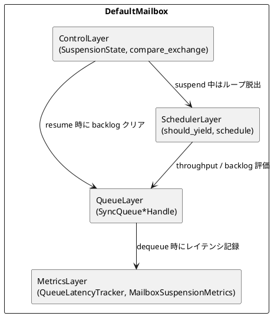

# DefaultMailbox 同期化ロードマップ (2025-09-28)

## キーワード定義
本ドキュメントでは RFC 2119 に準拠し、以下のキーワードで優先度を明示する。

- **MUST**: 移行に必須の項目。
- **SHOULD**: 推奨事項。正当な理由があれば延期可能。
- **MAY**: 任意項目。

## 背景
- Mailbox のホットパスはキュー操作・メトリクス記録・スケジューリング判定など短時間で完結する処理が多い。
- 現状は `tokio::Mutex` と `async_trait` を多用しており、`await` 境界で `Future` が頻繁に生成されるためレイテンシと CPU オーバーヘッドが発生している。
- utils 側の Queue 実装を同期 API に刷新したが、Mailbox 側が非同期のままでは恩恵を得にくい。

## ゴール
1. DefaultMailbox（および関連構造）を同期キューベースへ移行し、ホットパスから不要な `await` を排除する。
2. 既存 API を保ちつつ段階的に移行できるブリッジを提供し、remote/cluster など下流モジュールの影響を最小化する。
3. メトリクス・スケジューリング挙動・サスペンド/レジューム処理の正しさを維持するため、単体テストとベンチ強化を行う。

## 前提・制約
- `Mailbox` トレイトは `async_trait` を利用しているため、同期化には呼び出し側のランタイム境界を明示する必要がある。
- `Dispatcher` は `tokio` ランタイム上でスケジュールされるため、Mailbox の同期化は「内部ロックが同期化される」だけでよく、外部公開 API は当面 `async fn` を維持する。
- 既存ハンドル (`QueueWriterHandle`/`QueueReaderHandle`) は `Arc<tokio::Mutex<_>>` をラップしている。ここを `parking_lot::Mutex` へ切り替えるだけでは `await` を除去できないため、ハンドル層の API を同期化しラッパを用意する必要がある。

## 現況整理 (2025-09-28)

### 完了済みフェーズ
#### フェーズ 1: 設計・下準備 (完了: 2025-09-28)
- DefaultMailbox の責務を Queue/Metrics/Scheduler/Control の四層へ整理し、同期キュー化後の責務境界を UML と表で確定。
- ロック取得順序 L1 (`DefaultMailbox.inner`) → L2 (`QueueLatencyTracker.timestamps`) → L3 (`SyncQueue*Handle`) を文書化し、`DefaultMailbox::run` / `process_messages` との突合で逆順取得を排除。
- SyncQueue ハンドル導入方針を策定し、関連ドキュメント (`docs/mailbox_lock_order.md` 等) を更新。

#### フェーズ 2: ハンドル層の同期化 (完了: 2025-09-28)
- `SyncMailboxQueueHandles` / `SyncQueueWriterHandle` / `SyncQueueReaderHandle` を実装し、`Arc<tokio::Mutex<_>>` 依存を解除。
- `DefaultMailboxInner` が同期ハンドルを直接保持する構成へ移行し、`offer` / `poll` / `clean_up` を同期 API に統一。
- `MailboxProducer` や `Bounded/UnboundedMailboxQueue` を `SyncQueueSupport` へ揃え、テストハーネスの `await` を同期呼び出しへ整理。

#### フェーズ 3: ランループ・メトリクス最適化 (完了: 2025-09-28)
- `run` ループをロック解放後に `await` する構造へ再設計し、`Dispatcher::yield_hint` と `MailboxYieldConfig` の連携を starvation 防止付きで統合。
- `MailboxSuspensionState` を導入し、`compare_exchange_scheduler_status` や `record_queue_*` を同期メソッドへ集約。
- `QueueLatencyTracker` / `MailboxSuspensionMetrics` を `parking_lot::Mutex` + `Instant` ベースへ移行し、ヒストグラム・Gauge の収集パスを刷新。

#### フェーズ 4: API 整理と後片付け (完了: 2025-09-28)
- `MailboxSync` / `MailboxSyncHandle` を追加し、`MailboxHandle::sync_handle()` で同期ハンドルを取得可能にした。
- `remote::EndpointWriterMailbox` に同期カウンタとスナップショット間引き設定を導入し、`ConfigOption::with_endpoint_writer_queue_snapshot_interval` を追加。
- `bench/benches/mailbox_throughput.rs` を整備し、同期化後の性能測定フローを確立。

## 未完了タスクと優先度 (2025-09-28 時点)

### MUST
- [ ] **MUST** MailboxSync RFC の確定とレビュー承認（目標日: 2025-10-02）
  - 完了条件: RFC ドキュメントを提出し、cluster/remote オーナー承認と移行スケジュールの合意を得る。
- [ ] **MUST** remote/cluster/integration 経路の同期ハンドル全面移行（目標日: 2025-10-07）
  - 完了条件: 互換アダプタを削除し、`cargo test --workspace` とリモート系統合テストがグリーンで通過、リリースノート草案を更新。
- [ ] **MUST** 同期化リグレッション検証ラインの再構築（目標日: 2025-10-09）
  - 完了条件: ベンチ比較レポート（同期化前後）、Grafana 閾値更新の運用合意、`cargo bench --bench mailbox_throughput` 最新値の記録を完了。

### SHOULD
- [ ] **SHOULD** メトリクススナップショット間引き値のチューニングとダッシュボード更新
  - 完了条件: `queue_latency_snapshot_interval` 推奨値の決定と `docs/mailbox_dashboard_design.md` の更新。
- [ ] **SHOULD** EndpointWriterMailbox メトリクス購読フラグの運用テスト
  - 完了条件: remote 経路の負荷試験ログでオーバーヘッド削減を確認し、手順を運用 Runbook に追記。

### MAY
- [ ] **MAY** `bench/benches/mailbox_throughput.rs` / `queue_throughput` の継続計測とトレンド共有
  - 完了条件: 月次レポートフォーマットを確立し、`docs/bench_dashboard_plan.md` にフィードバックを反映。

## 検証計画
- フェーズごとに `cargo check --workspace` と `cargo test --workspace` を必須チェックとする。
- Mailbox 関連の割り込みケース（サスペンド/レジューム、優先度付きキュー、システムメッセージ）を網羅する統合テストを追加。
- 既存ベンチ `queue_throughput` に加え、Mailbox 全体を計測する Criterion ベンチを新設。

## リスクと緩和策
- **同期ロック化によるデッドロックリスク**: 呼び出し順序を明示した設計ドキュメントを用意し、コードレビューで確認。
- **Tokio ランタイムとの互換性**: スケジューラへ制御を戻すポイントを保持し、`Dispatcher` とのインターフェイス変更を最小化。
- **ベンチ結果の劣化**: 各フェーズでベンチを取り、性能が悪化した場合は即座にロールバックまたは代替案を検討。

## 次アクション (2025-09-28 時点)
- **MUST-1** MailboxSync RFC の確定とレビュー承認を 2025-10-02 までに完了する。
- **MUST-2** remote/cluster/integration 経路を同期ハンドルへ全面移行し、互換アダプタ撤去とテストグリーンを 2025-10-07 までに揃える。
- **MUST-3** 同期化リグレッション検証ラインを 2025-10-09 までに整備し、ベンチ比較と運用合意を取得する。
- **SHOULD** メトリクススナップショット間引きと Grafana テンプレート更新を継続し、推奨値決定後にドキュメントを更新する。
- **SHOULD** EndpointWriterMailbox のメトリクス購読フラグ運用テストを実施し、Runbook へ反映する。
- **MAY** ベンチ系継続測定のテンプレート化を進め、docs/bench_dashboard_plan.md へフィードバックする。

## ベンチ結果 (2025-09-28)
- 実行コマンド: `cargo bench --bench mailbox_throughput`
- 計測対象: `DefaultMailbox` + unbounded MPSC メールボックス
- 最新結果 (2025-09-28 再計測、`MAILBOX_QUEUE_SNAPSHOT_INTERVAL` = 1/8/64):
  - `mailbox_process/unbounded_mpsc_100`
    - snap1:   time 613.15 µs – 678.09 µs / throughput 147.47 Kelem/s – 163.09 Kelem/s
    - snap8:   time 217.55 µs – 223.31 µs / throughput 447.81 Kelem/s – 459.67 Kelem/s
    - snap64:  time 145.17 µs – 160.46 µs / throughput 623.23 Kelem/s – 688.87 Kelem/s
  - `mailbox_process/unbounded_mpsc_1000`
    - snap1:   time 5.8195 ms – 6.4125 ms / throughput 155.94 Kelem/s – 171.83 Kelem/s
    - snap8:   time 2.1108 ms – 2.2022 ms / throughput 454.08 Kelem/s – 473.76 Kelem/s
    - snap64:  time 989.41 µs – 1.2159 ms / throughput 822.43 Kelem/s – 1,010.7 Kelem/s
- 備考: スナップショット間引きによりフェーズ3直後と比べて 3〜4 倍の改善を得た。同期化前ピーク (~0.11ms / ~0.97Kelem/s) との差分は残るため、docs/mailbox_metrics_optimization_plan.md を参考に追加軽量化を検討する。

### 参考: 同期化前コミット (`0ae465fc`)
- 条件: `bench/benches/mailbox_throughput.rs` を手動追加して実行
- 結果:
  - `mailbox_process/unbounded_mpsc_100`
    - time: 3.7656 ms – 3.9155 ms
    - throughput: 25.539 Kelem/s – 26.556 Kelem/s
  - `mailbox_process/unbounded_mpsc_1000`
    - time: 35.796 ms – 39.212 ms
    - throughput: 25.502 Kelem/s – 27.936 Kelem/s

次ステップでは、同期化前コミットでの測定と `run` ループ再構成後の再計測を予定。

進捗はこのファイルに追記し、完了タスクを `- [x]` へ反映すること。
